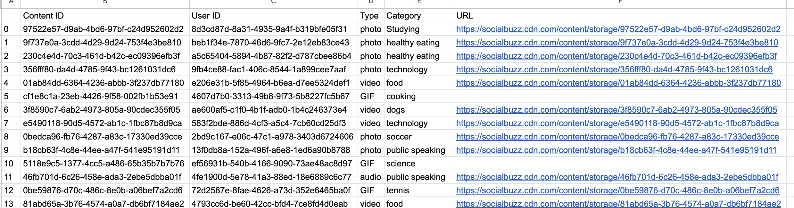
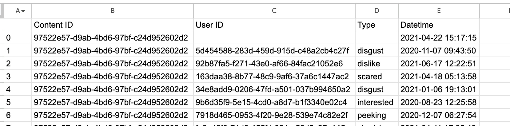
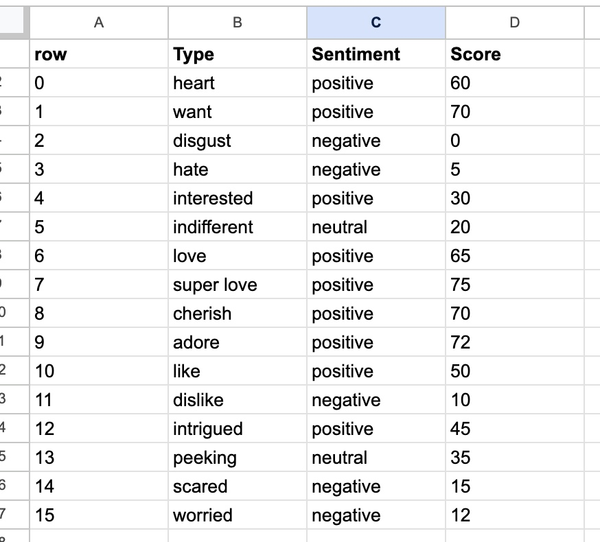
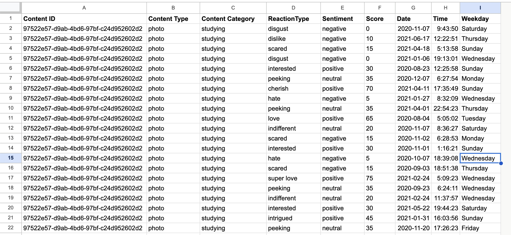
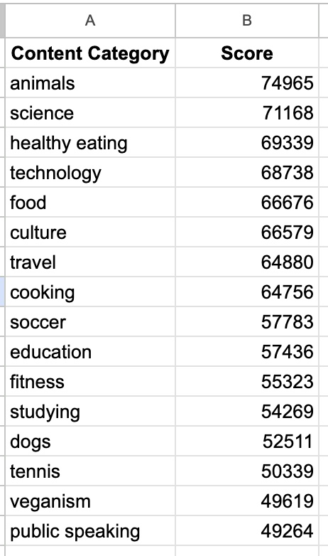
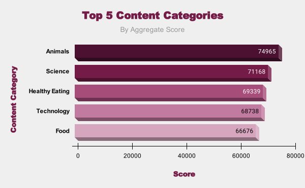
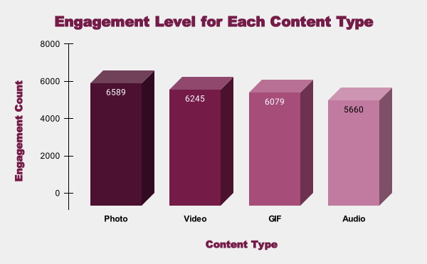

```{r setup, include=FALSE}
knitr::opts_chunk$set(echo = TRUE)
```
*Check out the files here:* <https://github.com/remydrain/social-buzz>

## Brief
A social media company would like an analysis of their content categories, highlighting the top 5 categories with the largest aggregate popularity. Additional insights into the data would be welcome.

## Questions to Answer
* What are the top 5 content categories?
* What content type receives the most engagement?
* What day of the week and time of day are users most active?
* What's the most popular reaction type?

## About the data
The data was provided in the form of three separate CSV files representing:

* Content
* Reactions
* Reaction Types

We were also provided a data model, which I'll include in the spreadsheet workbook. Note that for my portion of the analysis, some data tables referenced in the data dictionary were excluded as they're out of scope of what I'm tasked with.

## Tools Used
* Google Sheets

## Process
### Cleaning and Aggregating
Since the amount of data is relatively small, I was able to handle it in Google Sheets. I loaded each of the tables into their own sheet and took a first pass over the data to see what I was working with and what columns I would be using to join the data, then did some cleaning up on the second pass.

Here's the Content table before any cleaning:



I started by removing the URL and User ID columns, since they're not necessary for my analysis, and then I added filters to make sure that the sheet isn't missing any data, as well as to get a sense of what the 'Type' and 'Category' columns contain.

When I looked through the content categories, I found that there were some wrapped in quotation marks, and a couple categories had the first letter capitalized where the majority didn't. I used Find and Replace to remove all quotation marks and to standardize case. I didn't find any other issues with the data, so I moved onto the Reactions sheet.



As with the previous sheet, I removed the User ID column, then filtered to get a sense of the data. There were just under 3,000 rows out of about 25,500 that had missing values in the Type column. After verifying the instructions provided in the case of missing data, I deleted those rows.

Since I was interested in exploring how engagement varied throughout the week and times of day, I went ahead and split the Datetime into two separate columns, then added another column showing the day of the week.

The ReactionTypes sheet did not require any cleaning.



After taking one more pass over the sheets to make sure they were sufficiently cleaned, I duplicated the Reactions sheet to act as the base for my Aggregate, since it contained the most data of the three. I used VLOOKUP to pull in the Type and Category columns from the Content sheet (matched on Content ID), and the Sentiment and Score columns from the ReactionTypes sheet (matched on Reaction Type). I scrolled through and randomly spot-checked several rows to make sure the data matched up correctly between the aggregate and the separate tables. Here's a glimpse of the aggregated sheet:



### Identify the Top 5
The primary objective was to get the top 5 most popular content categories, as measured by the total reaction score. In order to do this, I first needed to identify all the categories, which I did using the UNIQUE function pointing to the range of Content Categories. Then I used SUMIF to get the total score of each category, and sorted descending by score to get all the categories with their total scores, in order from most popular to least.



We can see from this that the top 5 content categories, in order, are:

* Animals
* Science
* Healthy Eating
* Technology
* Food

To make that look a little more interesting, I put it into a bar chart with just the top 5.



### Most Engaging Content Type
Now that I had the main objective done, I could explore the data further with my own questions, starting with what *type* of content had the most engagement. I measured engagement by the number of reactions — of any sentiment — each particular type of content received. I again pulled in the different content types into a blank sheet, then used COUNTIF to tally the number of engagements for each type.




## Conclusions

* What are the top 5 content categories?
* What content type receives the most engagement?
* What day of the week and time of day are users most active?
* What's the most popular reaction type?
